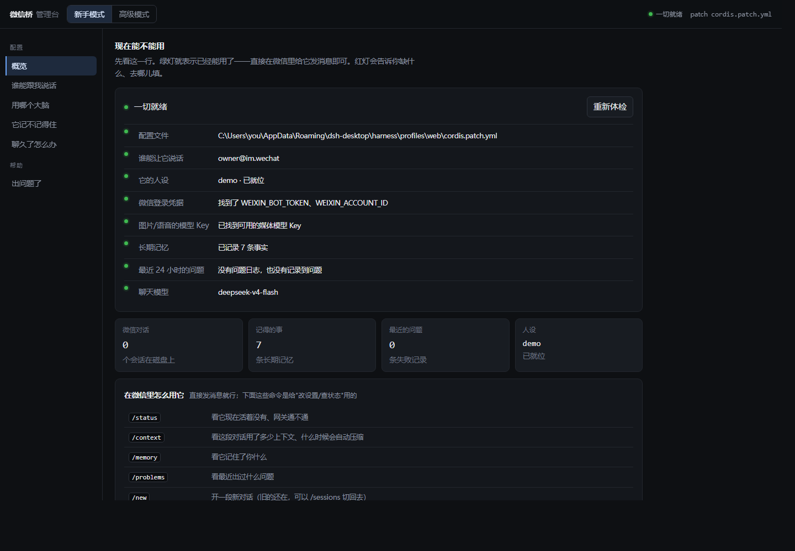
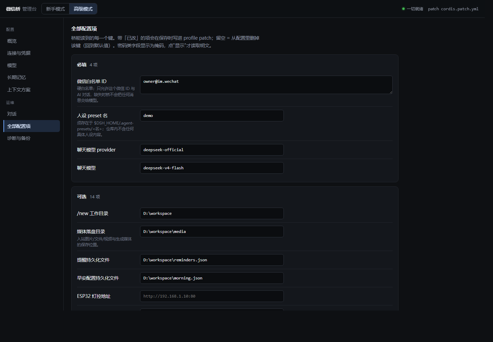

<div align="center">
  
  <h3>Chat with, monitor, and approve your DSH agents from WeChat.</h3>
  <p>Two-way <b>text · images · voice · files · video</b> over Tencent's <b>clawbot iLink</b> gateway — no public IP, no port forwarding, no browser.</p>

  [](https://github.com/PRTS168/dsh-wechat-suite/releases)
  [](LICENSE)
  
  
  
  

  <p>
    <a href="#-what-it-is">What it is</a> ·
    <a href="#-60-second-setup">60-second setup</a> ·
    <a href="#-features">Features</a> ·
    <a href="#-configuration">Configuration</a> ·
    <a href="#-commands-and-tools">Commands</a> ·
    <a href="#-standalone-admin-console">Admin console</a> ·
    <a href="#-long-term-memory">Memory</a> ·
    <a href="#-v40-highlights">Changelog</a> ·
    <a href="README.zh.md">中文说明</a>
  </p>
</div>

## 🧭 What it is

A [DeepSeek Harness](https://github.com/deepseek-ai/deepseek-harness) bundle that connects a
DSH profile to a WeChat personal account over Tencent's **clawbot iLink** gateway
(`ilinkai.weixin.qq.com`) — the protocol behind Tencent's own WeChat bot clients, driven here
against a personal account with no official support.

```
you (WeChat)  ⇄  iLink  ⇄  wechat-gateway  ⇄  wechat-conversation-node  ⇄  DSH agent session
```

| Plugin | Role |
| --- | --- |
| **`wechat-gateway`** (`WechatGateway`) | iLink service (`ctx.wechat`): QR login, authenticated long-poll, reconnect/backoff, send retry + rate-limit circuit, typing indicator, encrypted CDN media download/upload, inbound dedup |
| **`wechat-conversation-node`** | WeChat ⇄ DSH bridge: allowlist gate, session targeting, commands, context rotation, multimodal media (OCR/STT/TTS/image-gen/file/video), reminders & morning weather, digest outbound, approvals, light control |

---

## ⚡ 60-second setup

Prerequisites: Node ≥ 22, pnpm, a **dedicated WeChat account**, and a DSH profile.

```sh
dsh plugin --profile <your-profile> add github:PRTS168/dsh-wechat-suite  # 1 install into the profile
pnpm login                                                             # 2 scan the QR, store credentials
pnpm setup                                                             # 3 fill in the allowlist and the rest
```

Restart `dsh web`, send the bot a WeChat message, and you should get a reply. Other install
paths (Release tarball, build from a checkout) and the step-by-step version live in
[Quickstart](#-quickstart); if something is off, the [admin console](#-standalone-admin-console)
health report names what is missing.

> [!WARNING]
> **One poller per account.** iLink allows exactly ONE authenticated poller per bot token.
> Running a second instance of this bridge — or any other iLink client — against the same
> WeChat account causes HTTP 403 and dropped messages. Use a **dedicated WeChat account**,
> and treat the account as disposable: Tencent may restrict it at any time.

> [!IMPORTANT]
> **Two things must be filled in.** An `allowFrom` allowlist entry, and the `WEIXIN_BOT_TOKEN` /
> `WEIXIN_ACCOUNT_ID` / `WEIXIN_BASE_URL` credentials. Without them the bridge stays safely
> idle — it never feeds a non-allowlisted message to the model. Everything that looks like
> `<...>` is a placeholder you must fill in, and persona presets are not shipped: point
> `agentPreset` at a preset of your own under `$DSH_HOME/.agent-presets/<name>/`.

---

## ✨ v4.0 highlights

- **Context management, reworked** — one session for good, plus layered memory: `/context` reports
  the real occupancy, the compaction trigger point, and how many tokens survive verbatim.
- **Long-term memory (new)** — a cross-session `MEMORY.md` fact file, a `remember_fact` tool
  ("remember this" lands on disk immediately), and a daily consolidation pass.
- **Web admin console, rewritten** — beginner/advanced modes, an 8-check health report where every
  failure says how to fix it, config backups, and one-click rollback.
- **Problem ledger (new)** — every swallowed failure leaves a trace: `/problems` to read it,
  gateway health in `/status`, and rate-limited notices instead of a flood.
- **Real bugs fixed** — `send_email` always reporting "SMTP not configured" (the host silently
  dropped the keys), the model echoing the message fence, a leaking heartbeat timer, false alarms.

Read more: [v4.0 release notes](releases/v4.0-release-notes.md) · every change: [CHANGELOG.md](CHANGELOG.md) · older: [releases/](releases/)

---

## 🚀 Quickstart

**Prerequisites** — Node ≥ 22, pnpm, a dedicated WeChat account, a DSH profile.

### One-command install

`dsh plugin … add` runs one `pnpm add` inside your profile, so any pnpm target
works — a git repository, a release tarball, an npm package name, or a local path:

```sh
# straight from the repository (no registry needed)
dsh plugin --profile <your-profile> add github:PRTS168/dsh-wechat-suite

# from a release tarball
dsh plugin --profile <your-profile> add \
  https://github.com/PRTS168/dsh-wechat-suite/releases/download/v4.0/dsh-cowork-chatnode-wechat-4.0.0.tgz

# from an npm registry, once published
dsh plugin --profile <your-profile> add <package-name>
```

Then jump to *Pair the WeChat account* below. Building from a checkout works the
same way:

```sh
# 1. install from a checkout
git clone https://github.com/PRTS168/dsh-wechat-suite.git
cd dsh-wechat-suite
pnpm install && pnpm build
dsh plugin --profile <your-profile> add .

# 2. pair the WeChat account once (prints a QR URL to scan)
pnpm login            # → WEIXIN_BOT_TOKEN / WEIXIN_ACCOUNT_ID / WEIXIN_BASE_URL

# 3. fill the remaining placeholders (backup first, then patch the profile)
pnpm setup            # interactive
# or non-interactive; siliconflowKey fills OCR / image-gen / STT / TTS at once
pnpm setup --yes --set allowFrom=<your-wechat-id>@im.wechat --set siliconflowKey=sk-...
```

Then **restart `dsh web`** and send the bot a WeChat message. To bring up the console too:

```sh
node admin/server.ts          # or admin/start-admin.bat on Windows
# → http://127.0.0.1:8790/    (token minted into admin/.admin-token)
```

---

## 🎯 Features

| Area | What you get |
| --- | --- |
| **Messages** | Two-way text (replies re-formatted for WeChat: headings → `【】`, fences stripped + indented, tables de-lined); inbound messages fenced with a timestamp so the model can tell a real user turn from its own output |
| **Vision** | Inbound images as a real `image` block for multimodal routes, or DeepSeek-OCR text + path for text-only routes; `imageInput: auto\|native\|ocr` and `/识图` at runtime; `generate_image` (Kwai-Kolors) outbound |
| **Voice** | Inbound voice transcribed (XingChenASR or WeChat's own transcript); the agent replies with `speak` (CosyVoice2 clone voice) as an mp3 attachment |
| **Files & video** | Inbound documents/videos decrypted to `mediaDir` with the original file name; `wechat_send_file` / `wechat_send_video` send them back (playable mp4/mov attachment — iLink has no native video bubble) |
| **Sessions** | `/sessions /use /new /stop /status`, auto-resume of the newest `wechat-` session, hard isolation from Web-GUI sessions via the `wechat-` prefix |
| **Context** | `contextPolicy` rotation on turns / context pressure / token budget / idle time, with a free handoff note; switch schemes from the console |
| **Control** | `/model` and `/perm` two-step menus; `/yes` `/no` (or bare `1` / `2`) approvals; `/开灯` `/关灯` or `/gear` `/off` `/low` `/mid` `/high` light control (`control_esp32_light`) |
| **Proactive** | `set_reminder` (per-peer, persistent, catch-up after downtime) and the daily `/早安` weather digest (Open-Meteo, zero LLM cost) |
| **Email** | `send_email` over a configured implicit-TLS SMTP account |
| **Noise control** | Digest-style outbound: one heartbeat line per `digestIntervalSec`, replies chunked to `maxMessageChars` with throttling, end-of-turn notices only for error / abort / truncation |

---

> [!TIP]
> **`/早安 test` answering `fetch failed`?** That is almost always a local or system proxy
> swallowing `api.open-meteo.com`. The request is retried directly (bypassing the proxy), and
> when both attempts fail the error names the real cause (`ENOTFOUND`, `ECONNREFUSED`, TLS).

## 🧠 Long-term memory

A cross-session facts file at `${DSH_HOME}/wechat-memory/MEMORY.md`, with five sections plus a
retired-facts ledger:

```markdown
## 关于主人
- 主人有两个邮箱：主 owner@example.com、副 alt@example.com（2026-09-13）

## 偏好与习惯
## 常用设备与环境
## 待办与承诺
## 重要决定
## 已过期
- 主人在 Example City（作废 2026-09-13）
```

- **How facts get in**: ① the model calls `remember_fact` when the owner says "记一下…", which
  writes immediately; ② a scheduled consolidation (04:30 by default) folds that day's owner
  utterances in. Both paths use the same writer: atomic replace + backup first + a 4000-character
  cap + one audit line per change (`memory-log.md`).
- **How it comes out**: injected as **background**, placed **outside** the user-message fence —
  the persona's hard rule is that only fenced content is the owner speaking, so memory can never
  be mistaken for a command. A file with no facts is **not injected** at all.
- **It is not forgotten**: it survives session switches, restarts and compaction; after a
  compaction the bridge re-injects it on the next message.
- **The owner can read and edit it any time**: `/memory` prints it, and the file is plain
  Markdown — edit it in Notepad and the next injection picks it up.

> [!NOTE]
> Writes are **bounded**: only facts the owner stated himself and that stay true over time (name,
> city, schedule, habits, devices and paths, promises, decisions). Passwords / tokens / API keys,
> one-off arrangements, small talk and the model's own words are never written. One fact is capped
> at 300 characters (a longer one is truncated, and the receipt says so) and the whole
> file at 4000 (past that the write is refused outright rather than silently dropped).

## ⚙️ Configuration

```yaml
# profile patch (cordis.patch.yml)
plugins:
  dsh-chatnode-wechat:
    allowFrom: ["<your-wechat-id>@im.wechat"] # hard allowlist, REQUIRED, no default
    digestIntervalSec: 300            # heartbeat summary while a turn runs
    approvalTimeoutSec: 600           # approval timeout -> default deny
    maxMessageChars: 2000             # WeChat bubble cap (protocol limit)
    sendChunkDelayMs: 1500            # throttle between outbound bubbles
    imageInput: auto                  # auto | native | ocr
    contextPolicy: '{"scheme":"manual"}'   # see releases/v0.3.0-release-notes.md
    # imageInputModel: amd/DeepSeek-V4-Flash-Vision-Exp  # vision route for pictures only
    # agentPreset: wechat             # optional persona preset (lives outside this repo)
    # agentProvider / agentModel: ... # model route for the WeChat agent
    # esp32BaseUrl: http://<esp32-ip>:80   # light control (optional; no built-in default, fill it in to use it)

    # ---- media helpers (all optional; each capability degrades gracefully) ----
    # ocrApiKey / ocrModel: deepseek-ai/DeepSeek-OCR / ocrBaseUrl
    # imageGenApiKey / imageGenModel: Kwai-Kolors/Kolors / imageGenDir
    # sttApiKey / sttModel: XingChenAGI/XingChenASR-V3.2-Ultra
    # ttsApiKey / ttsModel: FunAudioLLM/CosyVoice2-0.5B / ttsVoice: speech:<voice-uri>
    # mediaDir: <dir>     # inbound media (default $DSH_HOME/attachments/wechat)
    # reminderFile / morningFile: <paths, default under $DSH_HOME>

    # ---- email (optional; host + username + password must all be set to send) ----
    # smtpHost: smtp.example.com
    # smtpPort: 465                     # implicit TLS
    # smtpUsername: you@example.com     # also the From address
    # smtpPassword: <app password>
    # smtpFromName: <display name>

    # ---- long-term memory (optional, every key has a default) ----
    # memoryFile: $DSH_HOME/wechat-memory/MEMORY.md
    # memoryInjectEvery: 10             # re-inject the briefing every N messages
    # memoryConsolidateTime: "04:30"    # daily consolidation; empty = never
    # problemFile: $DSH_HOME/wechat-problems.log   # problem ledger

    # ---- gateway tuning (optional) ----
    # longPollTimeoutMs / apiTimeoutMs / pollIdleDelayMs / retryDelayMs
    # backoffDelayMs / maxConsecutiveFailures / sessionExpiredPauseMs
    # sendChunkRetries / sendChunkRetryDelayMs
    # rateLimitCircuitOpenMs / rateLimitCircuitWindowMs / rateLimitCircuitThreshold
    # allowCdnHosts: [...]              # SSRF allowlist for media downloads
```

`allowFrom` is mandatory and has no permissive default: missing it fails startup, and messages
from non-allowlisted senders are logged and ignored — never fed to the model.

> [!TIP]
> Every one of these can be edited in the **admin console** (beginner mode shows the handful that
> matter, advanced mode lists them all). The gateway tuning keys used to be a trap: they were
> declared but never forwarded, so setting them changed nothing, silently. All four key sets
> (bundle schema / forwarding list / node schema / console fields) must now be equal, and a
> `config-surface` test enforces it — which is how the `send_email` "SMTP 未配置" bug was caught.

<details>
<summary><b>Native image input vs OCR — and the declaration trap</b></summary>

| Mode | What the model gets | When |
| --- | --- | --- |
| `native` | a real `image` content block (it sees the pixels) | the routed model declares `image` input |
| `ocr` | `【OCR 识别结果】` text + the file path | the routed model is text-only, or nothing declares image support |

- **`auto`** (default) — resolve the route the agent actually chats on, ask `llm.listModels()`
  for its `inputModalities`, and send an image block when `image` is declared. If the chat route
  is text-only, `auto` looks for another registered route that declares image support (set
  `imageInputModel` to pin one instead), and otherwise uses OCR.
- **`native`** — always attempt the image block. A route that does not *declare* image support is
  still tried once (the endpoint may accept images without advertising them); when it refuses,
  that route is suppressed for three hours and later pictures take the OCR path instead of
  burning a turn each time.
- **`ocr`** — always the text path. Cheaper and often more accurate for documents and screenshots.

**Declaring the modality is the switch.** The harness gates image blocks on the model's declared
`inputModalities`, upstream of the wire — a text-only declaration means no image is ever sent. The
DeepSeek adapter's built-in catalog predates DeepSeek 4.1 (it records `deepseek-v4-flash` as
text-only, and the retired `deepseek-v4-flash-vision-exp` was its only image entry), so declare it:

```yaml
llm-deepseek:
  models:
    - id: deepseek-flash
      inputModalities: [text, image]
```

This `models:` list **replaces** the plugin catalog rather than extending it, so list every id you
route to — if your profile routes to the legacy alias `deepseek-v4-flash`, list it as well, or that
route stops resolving.

`/识图` reports and switches the mode at runtime (`auto` / `native` / `ocr`); the override lasts
until `dsh web` restarts. Both modes keep the `[微信图片] <path>` prefix, so the session log stays
replayable and the agent can re-read the file.

```
/识图                 # current mode + routed model
/识图 native          # force image blocks
/识图 ocr             # force OCR text
```

</details>

---

## 🎛️ Commands and tools

<details open>
<summary><b>Commands (send in WeChat)</b></summary>

| Command | What it does |
| --- | --- |
| *(plain text / image / voice / file / video)* | routes to the active agent |
| `/sessions` | numbered session list (`wechat-` only, most recent first) |
| `/use N` | switch the active session |
| `/new <prompt>` | create a fresh agent+session and start |
| `/stop` | cancel the active turn |
| `/status` | agent status + session summary + **gateway health** (online / reconnecting / paused / stopped) |
| `/context` | context usage, model window, breakdown, the compaction trigger point, how much stays verbatim, fact count |
| `/memory` | view the long-term memory; `/memory now` consolidates once, immediately |
| `/problems` | the problems that were recorded (list only); `/problems clear` empties the list, the log stays |
| `/send <path>` | send a local image to the current contact |
| `/model` | two-step model switcher (list, then pick a digit) |
| `/perm` | two-step permission-preset switcher (list, then pick a digit) |
| `/识图 [auto\|native\|ocr]` | image-input mode; no argument reports mode + routed model |
| `/早安 on\|off\|status\|test\|HH:MM` (alias `/morning`) | morning weather digest |
| `/开灯` `/开灯1\|2\|3` `/关灯` | ESP32 light control (gear 3 / low / mid / high / off) |
| `/gear` `/off` `/low` `/mid` `/high` | same implementation under the device's own vocabulary (query / off / low / mid / high) |
| `/yes` `/no` (or `1`/`2` while one request is pending) | answer a permission request |
| `/help` | command list |

</details>

<details>
<summary><b>Agent tools (available to the model)</b></summary>

| Tool | Purpose |
| --- | --- |
| `wechat_send_image(path)` | send a local image to the peer |
| `wechat_send_file(path)` | send any local file to the peer |
| `wechat_send_video(path)` | send a local video (playable mp4/mov attachment) |
| `generate_image(prompt)` | text-to-image (Kolors), then send it |
| `speak(text)` | TTS with the cloned voice, sent as an mp3 attachment |
| `send_email(to, subject, body)` | plain-text mail over the configured SMTP account |
| `control_esp32_light(mode)` | `query` / `off` / `low` / `mid` / `high` on the LAN light |
| `set_reminder(text, inMinutes\|atTime)` | schedule a reminder (per peer) |
| `list_reminders()` | list pending reminders |
| `cancel_reminder(id)` | cancel a reminder |
| `remember_fact(text, section?, replaces?)` | **write a fact the owner stated straight into long-term memory** (`replaces` retires a superseded fact) |

</details>

### ✅ Approvals

WeChat has no buttons, so permission requests arrive as numbered text and are answered in chat:

```
#1 needs your confirmation
tool: bash
reason: run a destructive command
reply /yes to allow, /no to reject (1/2 while exactly one is pending)
no reply within 10 minutes -> automatically denied
```

`/yes` grants `allowed-once`; `/no` rejects; a timeout falls back to the DSH default deny. The
bridge answers only requests for the agent it currently drives; everything else is delegated down
the answerer chain.

---

## 🖥️ Standalone admin console

`node admin/server.ts [--port 8790]` (`admin/start-admin.bat` on Windows) starts a loopback-only
HTTP console that is **not** part of the DSH plugin tree — it cannot affect profile boot, and
stopping it cannot stop the bridge.

The page has **two modes**, switched in the top-left corner (the choice is remembered):

| Mode | For | What it shows |
| --- | --- | --- |
| **Beginner** | people who do not want to learn the config surface | only the few things that must be understood, in plain language: who may talk to it (allowlist) / which brain it uses (model dropdown) / whether it remembers (memory + daily consolidation time) / what happens when a chat gets long (two choices), plus a "something broke" page with the raw log; one health summary line on top |
| **Advanced** | people who want all of it | every config key (grouped) / provider and image routes / memory and problem-log paths / every context scheme (`manual` + the five rotation policies) with knobs and the raw JSON / conversations and transcripts / config backups and **one-click rollback** / the full environment self-check |

**Beginner mode** — one glance at whether it can work right now; a red dot names what is missing
and where to put it:



**Advanced mode** — every config key, grouped into required / optional, with secret fields masked:



> Both screenshots come from a demo instance: every value, path and persona is placeholder data.

| Endpoint | What it does |
| --- | --- |
| `GET /api/state` | config values (secrets masked), field definitions, context schemes, conversations |
| `GET /api/health` | the 8 checks: config file / allowlist / persona / WeChat credentials / media keys / long-term memory / recent problems / chat model |
| `GET /api/problems` · `GET /api/memory` | the problem ledger, raw · the long-term memory, raw |
| `GET /api/models` | the real model list read from `settings.yaml` (including third-party relay names) |
| `GET /api/backups` · `POST /api/rollback` | backup list (newest by time) · roll back (the current config is backed up first) |
| `POST /api/config` · `POST /api/scheme` | write the patch (only changed keys) · switch context scheme |
| `GET /api/conversations` · `/api/transcript` · `POST /api/session/*` | conversations / transcript / new / forget (recoverable) |

**Security posture** — binds to `127.0.0.1` only · token minted on first start into
`admin/.admin-token` (override with `WECHAT_ADMIN_TOKEN`) · every API call needs that token ·
mutations additionally need the `x-wechat-admin: 1` guard header, which is a real second factor
now (it used to sit behind two `return true` branches and was therefore unreachable) · the `Host`
header must be a loopback authority, so a DNS-rebinding page cannot reach it · a config file that
cannot be read is **refused** rather than overwritten (that used to replace the whole patch,
taking every other plugin's entries with it) · numeric fields are validated server-side, because a
quoted `"25 分钟"` in an integer key makes the plugin fail its schema and takes the whole profile
down. Session commands are queued on disk (`$DSH_HOME/wechat-admin/queue/`) and executed by the
bridge within ≤ 2 s; the console also shows the bridge's last reports. The token file is
git-ignored.

> [!NOTE]
> Since v0.3.0 there is **no in-GUI settings page** — the `config-api` plugin row was removed
> (see *v0.3.0 → Fixed*). Configure through `cordis.patch.yml` or this console.

---

## 🧪 Development

```sh
pnpm install
pnpm build          # src/ -> lib/ (tsc)
pnpm typecheck
pnpm test           # node --test test/*.test.ts — 255 tests, no WeChat account
pnpm smoke          # manual live-account check
pnpm setup          # interactive config wizard
```

- `test/fake-ilink-server.ts` implements the iLink endpoints (long-poll, sendmessage, sendtyping,
  getconfig, QR login, encrypted CDN download) and replays `test/fixtures/inbound.ndjson`, so the
  inbound → session → outbound loop runs offline in CI (`.github/workflows/ci.yml`).
- Coverage includes gateway dedup (message id **and** payload fingerprint), inbound routing /
  media-failure paths / the message envelope, the command surface, the approval bridge, context
  rotation policies (including the token-budget fallback chain), light control, preset
  compatibility across both host versions, and `boot-safety.test.ts`, which pins the "never
  produce an unhandled rejection" property that used to crash the host.
- Honest gaps (not unit-tested): OCR success/failure branches, the voice-download-to-ASR flow,
  outbound media upload (the fake server has no `/upload`), `/send`, `/help`, restart resume, and
  the native-image block itself (`vision.test.ts` covers the mode/policy decision against a stub
  catalog; `attachments.saveImage` runs only on a live host). Live smoke covers the happy paths.
- Test spread (255): `memory` 36 · `node` 33 · `context-policy` 21 · `gateway` 18 · `light` 15 ·
  `vision` 10 · `commands` 11 · `problems` 10 · `approvals` 9 · `morning` 9 · `markdown` 9 ·
  `outbound-guard` 8 · `context-report` 8 · `robustness` 8 · `patch-config` 7 · `dedup` 6 ·
  `inbound-media` 6 · `resume` 5 · `config-surface` 5 · `user-message-envelope` 5 · `reminders` 4 ·
  `email` 4 · `picker` 4 · `packaging` 3 · `boot-safety` 1
- Guard tests added in v4.0: `config-surface` (the four config key sets must be equal — this is
  what stops the "SMTP config dropped by the host" class of bug), `problems` (ledger dedup,
  notification rate limiting, log rotation), `robustness` (refused writes, atomic writes,
  backup pruning by time, log rotation) and `outbound-guard`, whose cases are the real text from
  the 2026-09-13 incident.

---

## ⚠️ Known limits

- **Reference only** — verified on one specific environment (2026-09); portability is not promised.
  The protocol was reconstructed from existing iLink clients, with synthetic fixtures in-repo.

- Outbound voice/video arrive as **file attachments** (mp3/mp4), not native bubbles (iLink
  limitation). `silk.ts` and `gateway.sendVoice()` exist as unused spares (silk needs external
  ffmpeg + pilk).
- Some command receipts still contain emoji that are not stripped to match an emoji-free persona.
- Generated images/voice accumulate under `mediaDir/generated` (no auto-cleanup yet).
- WeChat `silk`-encoded voice needs real-device verification (m4a verified).
- Only 1:1 text messaging is targeted; group chats are ignored by design (MVP).
- The `rotate-pressure` context size is a proxy (serialized event characters), not model tokens;
  `rotate-tokens` is the accurate one when the host exposes session projections.

## 🛡️ Risks

| Risk | Mitigation |
| --- | --- |
| iLink exclusive lock — two pollers on one token → 403 + dropped messages | Dedicated account; loud fatal error + polling stop on 403 |
| Account restriction — unofficial gateway | Dedicated, disposable account; stated plainly in this README |
| DSH v0.1 churn | Two host versions verified (*v0.3.0 → Other*); optional services via `ctx.get()`; boot-safety tests |
| An unhandled rejection killing the host | All async entry points resolve; `.catch()` at call sites; hot-reload stress pass |
| Protocol opacity | Protocol reconstructed from existing clients; synthetic fixtures in the repo |
| Credential files in the repo root | `client-config.json` / `account.json` / `admin/.admin-token` are git-ignored |

---

## 📚 Version history

<details open>
<summary><b>v4.0</b> — context rebuild · admin console rewrite · long-term memory</summary>

- **Context**: one session by default; `/context` shows the real usage and the compaction trigger
  point; write the compaction parameters as `thresholdRatio 0.65 / retainRatio 0.25` (that avoids
  the "keep only the last message" overflow path); memory is re-injected after a compaction.
- **Long-term memory**: `MEMORY.md` + a daily 04:30 consolidation + the `remember_fact` tool +
  `/memory`.
- **Admin console**: beginner / advanced modes, 8 health checks, backups and one-click rollback,
  and the mutation guard header actually enforced.
- **Problem ledger**: `wechat-problems.log` + `/problems` + gateway health in `/status`, with
  notification rate limiting.
- **Fixed**: config silently dropped by the host (the real reason `send_email` said "SMTP 未配置"),
  the model writing the owner's lines, tool-calling steps reported as empty replies, the heartbeat
  timer leak, HTTP 403 after a hot reload, a NaN busy loop in the timers, and more.
- 255 offline unit tests (was 167).

See [`releases/v4.0-release-notes.md`](releases/v4.0-release-notes.md).

</details>

<details>
<summary><b>v0.3.1</b> — weather and command-surface fixes</summary>

- The weather push reports real failure reasons and retries directly, ignoring a host proxy.
- Bare `1` / `2` answer permission requests again; `/yes` and `/no` no longer claim to be unknown.
- The retired light vocabulary (`/gear` `/off` `/low` `/mid` `/high`) works again, proxy-safe.
- 167 offline unit tests (was 143).

See [`releases/v0.3.1-release-notes.md`](releases/v0.3.1-release-notes.md).

</details>

<details>
<summary><b>v0.3.0</b> — stability, context lifecycle, standalone console</summary>

Context rotation policies, host-stability hardening, failure visibility and the standalone admin
console — see [`releases/v0.3.0-release-notes.md`](releases/v0.3.0-release-notes.md).

- 143 offline unit tests (was 86).

</details>

<details>
<summary><b>v0.2.2</b> — DeepSeek 4.1 multimodal + native image input</summary>

- Inbound pictures reach the model as a real `image` block when the routed model declares image
  input, and as DeepSeek-OCR text otherwise; `imageInput` and `/识图` choose the policy, and a
  route that refuses an image is suppressed for three hours.
- Declaring the modality is the switch (see *Configuration → Native image input vs OCR*); the
  `models:` snippet **replaces** the plugin catalog rather than extending it.
- `send_email` over implicit-TLS SMTP; `client-config.json` / `account.json` git-ignored.

</details>

<details>
<summary><b>v0.2.1</b> — Web management page and persona editing</summary>

- **Settings → Plugins → "微信桥配置"** edited every placeholder in the browser, with masked
  secrets and timestamped backups; the same page edited agent preset personas.
  *(Removed in v0.3.0 — see *v0.3.0 → Fixed / Notes* above.)*

</details>

<details>
<summary><b>v0.2.0</b> — `/perm`, and files & videos both ways</summary>

- `/perm` two-step permission-preset switcher, plus `pnpm setup`.
- Inbound files/videos download and decrypt to `mediaDir` with the original name preserved;
  `wechat_send_file` / `wechat_send_video` send local files and clips back.
- Persona residue removed from the repo.

</details>

Full changelog: [`CHANGELOG.md`](CHANGELOG.md) · all announcements: [`releases/`](releases/)

## 🗺️ Roadmap

- **Next** — group chats (opt-in, risk-heavy), multi-account, a shared-poller proxy to coexist
  with hermes-agent / OpenClaw.
- **Later** — WeCom / DingTalk / Feishu bundles reusing the `node/` layer.

---

## 🙏 Acknowledgements

- **Protocol references** — the iLink wire details were reconstructed from existing WeChat bot
  clients (hermes-agent and OpenClaw); synthetic fixtures live in `test/fixtures/inbound.ndjson`
  (no real account data), so CI never needs a live account.
- **Platform** — [DeepSeek Harness](https://github.com/deepseek-ai/deepseek-harness) and the
  Cordis plugin model (`cordis`, `schemastery`) that this bundle extends.
- **Services used by the optional media helpers** — SiliconFlow (DeepSeek-OCR, Kwai-Kolors,
  XingChenASR, CosyVoice2) and Open-Meteo (morning weather).
- **Thanks** — to the DeepSeek Harness and Cordis communities whose plugins this bundle builds on.

## 📄 License

MIT — see [LICENSE](LICENSE).
