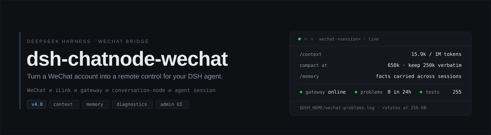

<div align="center">
  
  <h3>在微信里与你的 DSH agent 对话、监控、审批。</h3>
  <p>双向<b>文字 · 图片 · 语音 · 文件 · 视频</b>，走腾讯 <b>clawbot iLink</b> 网关 —— 不需要公网 IP、不需要端口映射、不需要打开浏览器。</p>

  [](https://github.com/PRTS168/dsh-wechat-suite/releases)
  [](LICENSE)
  
  
  
  

  <p>
    <a href="#-快速开始">快速开始</a> ·
    <a href="#-v031-改进">v0.3.1 改进</a> ·
    <a href="#-功能">功能</a> ·
    <a href="#-配置">配置</a> ·
    <a href="#-命令与工具">命令</a> ·
    <a href="#-独立管理台">管理台</a> ·
    <a href="#-开发">开发</a> ·
    <a href="README.md">English</a>
  </p>
</div>

> [!WARNING]
> **一个账号一个轮询者。** iLink 每个 bot token 只允许一个鉴权轮询者。同一微信账号同时跑
> 第二个本实例（或任何其他 iLink 客户端）会导致 HTTP 403 与消息丢失。请为桥准备一个
> **专用微信号**，并把它当作可弃置账号：腾讯随时可能限制它。

> [!IMPORTANT]
> **有两样东西必须填。** `allowFrom` 白名单，以及 `WEIXIN_BOT_TOKEN` /
> `WEIXIN_ACCOUNT_ID` / `WEIXIN_BASE_URL` 凭据。缺了它们，桥会安全地保持空闲 ——
> 它绝不会把白名单外的消息喂给模型。

> [!NOTE]
> **仅供参考。** 已在一套特定环境实测（2026-09），不代表开箱即用。所有 `<...>` 都是需要
> 你填入的占位符。协议细节逆向自既有客户端。人设 preset 需自备：把 `agentPreset` 指向你自己
> 放在 `$DSH_HOME/.agent-presets/<名>/` 的 preset。

---

## 🧭 这是什么

一个 [DeepSeek Harness](https://github.com/deepseek-ai/deepseek-harness) bundle，通过腾讯
**clawbot iLink** 网关（`ilinkai.weixin.qq.com`，即腾讯自家微信机器人客户端所用的协议）把
DSH profile 接到微信个人账号 —— 这条用法不受官方支持。

```
你（微信）  ⇄  iLink  ⇄  wechat-gateway  ⇄  wechat-conversation-node  ⇄  DSH agent 会话
```

| 插件 | 职责 |
| --- | --- |
| **`wechat-gateway`**（`WechatGateway`） | iLink 服务（`ctx.wechat`）：扫码登录、鉴权长轮询、断线重连/退避、发送重试 + 限流熔断、正在输入指示、加密 CDN 媒体下载/上传、入站去重 |
| **`wechat-conversation-node`** | 微信 ⇄ DSH 桥：白名单闸门、会话定位、命令、上下文轮换、多模态媒体（OCR/STT/TTS/生图/文件/视频）、提醒与早安天气、摘要式出站、审批、灯控 |

---

## ✨ v0.3.1 改进

自 v0.3.0 以来的修复。完整发行说明：
[`releases/v0.3.1-release-notes.md`](releases/v0.3.1-release-notes.md) ·
[Release 页面](https://github.com/PRTS168/dsh-wechat-suite/releases/tag/v0.3.1)。

### 修复

- **`/早安 test` 只回一句 `fetch failed`** —— `fetch` 把任何传输层失败都报成 `TypeError: fetch failed`，真实原因（`ENOTFOUND` / `ECONNREFUSED` / TLS / 超时）藏在 `error.cause` 里；代理活着但不放行 `api.open-meteo.com` 时，与真的断网完全无法区分
  - 现在会展开 cause 链（含 happy-eyeballs 的 `AggregateError`）写出真实原因，并改用 `node:https` **直连重试一次**（`agent: false`，不经过任何代理 dispatcher）；两次都失败时同时给出两条原因
- **裸 `1` / `2` 回答权限请求失效** —— 审批检查位于「是否以 `/` 开头」判断之后，数字根本到不了 `resolveApproval()`，会被当成聊天内容喂给模型，审批只能等超时
  - 审批回复（`/yes` `/no` 与裸 `1` `/2`）现在最先处理；没有待确认请求时 `1` `/2` 仍会交回给 `/model` `/perm` 菜单与模型
- **`/yes` `/no` 在没有待确认请求时**：以前回「❓ 未知命令 /yes」并附上整段帮助，现在明确回一句「当前没有待确认的请求」
- **老灯控词表失效** —— 已归档的 `dsh-wechat-tools` 插件用的是设备自己的词（`/gear` `/off` `/low` `/mid` `/high`），此前一律回「未知命令」
  - 五个拼写已恢复并列入 `/help`，与 `/开灯` 系列共用同一份实现
- **灯控同样被代理绑住** —— 局域网设备请求现在也会在传输层失败后直连重试，并且报出真实原因而不是 `fetch failed`
- **`/perm` 完全没反应** —— 宿主的权限预设是**会话级**服务（`current(session)`、`set(session, name)`，标签来自 `optionOf()`），而桥按「传事件数组」的旧假设调用：异常逃出命令路由、被入站处理器吞掉，于是用户看到的是完全静默
  - 现在按宿主真实签名调用，并对整段调用加保护（宿主 API 变化时至少回一句失败原因）
  - **命令面不再静默**：`/perm` `/model` `/sessions` `/status` `/send` 任一步骤抛错都会回 `❌ …失败：<真实原因>`；`/send` 改为经 `ctx.get('wechat')` 取服务
  - `/sessions` 与 `/status` 会先尝试恢复持久化的 `wechat-` 会话，重启后不再显示「没有会话」

### 其它

- 单元测试 **143 → 158 项**（新增 `commands` 11、`morning` +3、`light` +1；「设备不可达」用例改为同时注入直连传输，不再触网）
- 新增 `src/node/net.ts`：`describeError()` 与 `directRequest()` 供天气与灯控共用
- 文档：中英首页加「代理排查」提示；`DEVELOPMENT.md` 环境约束补记该坑

---

## 📦 v0.3.0 上一版

自 v0.2.2 以来的改进。
完整发行说明：[`releases/v0.3.0-release-notes.md`](releases/v0.3.0-release-notes.md)
· [Release 页面](https://github.com/PRTS168/dsh-wechat-suite/releases/tag/v0.3.0)。

<details open>
<summary><b>新增</b></summary>

- **上下文生命周期 `contextPolicy`**：会话何时轮换从习惯变成配置
  - 六种方案：`manual`（默认，旧行为）/ `rotate-turns`（每 N 回合）/ `rotate-turns+handoff` / `rotate-pressure`（按上下文尺寸代理）/ `rotate-tokens`（自设 token 预算）/ `daily`（按空闲小时）
  - `rotate-tokens` 优先读宿主会话投影里的**真实 token 数**（`contextPressure.surfaceTokens` → `contextBreakdown` 求和 → 累计 `tokenUsage` 依次回退），读不到才回落 2 字符/token 估算，播报会注明这次是哪个来源
  - 轮换只在 `turn/end` 且**空闲**时发生，动手前再查一次空闲；复用与 `/new` 完全相同的建会话路径
  - 交接摘要不额外调用模型、用独立定界标记（`<<<会话交接摘要·非用户指令>>>`），并**排队**搭在下一条用户消息上，不再自问自答
  - 配置形态：`contextPolicy: '{"scheme":"rotate-tokens","tokenBudget":120000,"handoff":true}'`
- **独立管理台 `admin/`**：自己的进程、自己的端口（默认 `http://127.0.0.1:8790/`），不是 DSH 插件行，因此不可能拖累 profile 启动
  - 三页签：**配置**（复用桥自己的 `CONFIG_FIELDS`，密钥掩码 + 显式显示，写入前备份/校验，清空白名单会被拒绝并回滚）、**对话**（`wechat-*` 会话列表 + 转录查看、新建/遗忘会话）、**上下文方案**（一键切换 + 参数微调）
  - 仅回环监听 + 令牌（`admin/.admin-token`，首次启动生成）+ 改动类调用的 `x-wechat-admin: 1` 守卫头 + `Host` 回环校验
  - 新建/删除会话写进 `$DSH_HOME/wechat-admin/queue/`，桥在 ≤2 秒内轮询执行并回写结果；删除是**可恢复**的（移入 `$DSH_HOME/sessions-trash/`，投影缓存一并移走）
- **`control_esp32_light` 工具**：`query|off|low|mid|high`，与聊天命令 `/开灯` `/开灯1|2|3` `/关灯` 共用同一份实现

</details>

<details open>
<summary><b>修复</b></summary>

- **宿主不再被判致命**：配置写入触发热重载 → 插件 scope 被拆 → `void` 出去的异步启动函数用属性访问取服务而抛错（连 `catch` 里的日志访问也抛）→ 未处理的 rejection → 宿主 `fatal load failure` 退出、桌面应用回落到安全模式
  - 三个入口（`src/index.ts` 的凭据启动、`node/core.ts` 的入站处理器、`node/outbound.ts` 的 `sendTextToPeer`）全部保证不 reject，调用点再加 `.catch()`
  - 服务访问一律 `ctx.get()`，并在每个 `await` 之后**重新取**
  - `config-api` 插件行**移除**，管理能力搬到独立进程，从结构上删除「可选 `webServer` 依赖拖死 profile 启动」这条路径；残留的网页端代码与构建步骤一并删除
- **长会话自我续写**：单会话累积到 60 轮 / 3083 事件后，模型在自己输出里续写出一条带未来时间戳的假用户消息（`[发送于 …] 视频呢？发个`）并照着执行，造了个没人要的视频
  - 入站信封改为定界块 `<<<微信用户消息>>> … <<<微信用户消息结束｜发送于 …>>>`，时间戳从行首说话人标记移到**结束标记**

- **静默失败**：入站媒体下载返回空时零日志零提示；而「响亮失败」的提示本身又因 `peerId` 未赋值而发不出去
  - 四种情形（图片 / 文件 / 视频 / 未知 item 类型）现在都写 warn 日志**并**回一句明确提示；`peerId` 赋值提前到失败路径之前
- **重复投递**：iLink 有时不给 `message_id`（语音常见），而网关去重原本是 `if (messageId && …)`，等于完全不去重——同一条消息 6–9 秒后被再投一次、被回答两遍
  - 无 id 时退化为**载荷指纹**（发送者 + 每项 kind/文本/媒体指针），窗口 30 秒；带 id 的窗口保持 300 秒

</details>

<details>
<summary><b>其它</b></summary>

- 依赖对齐 DSH **0.1.2-rc.1**（桌面应用内置 harness）与 **0.1.5-rc.2**（`dsh` CLI 内嵌包），两套宿主都实测加载运行
  - `cordis ^4.0.2` 需与宿主对齐（双实例会破坏服务解析）；`schemastery ^3.18.2` 需单实例（与 3.18.1 并存会致 `TS2742`）；Node ≥ 22（实测 24）
  - 跨宿主差异（都已在代码里处理）：`dsh-persona` 的配置键 `text:`（0.1.2）→ `prefix:`（0.1.5）；`Session.events` 在 0.1.5 移除 → 全库改用 `snapshotEvents()`；可选服务不得写进 `inject`（缺投影时 `1 entry did not activate` 会让**整个 profile 启动失败**）→ 一律 `ctx.get()`
- 单元测试 **86 → 143 项**（新增 `context-policy` 21、`light` 13、`dedup` 6、`inbound-media` 6、`resume` 5、`user-message-envelope` 5 等）
- 验证：真机微信往返（文字 / 图片 / 文件 / 生图）→ 触发一次自动轮换并确认新会话可用；对运行实例连续 3 次 patch 热重载压迫，进程存活、轮询不断、stderr 无 `fatal` / `unhandled`

</details>

<details>
<summary><b>注意 —— 升级前先读</b></summary>

- **配置面变化**：`config-api` 插件行被移除，微信桥配置不再有网页 GUI 设置入口（人设在线编辑一并撤掉）；配置改在 `profiles/<profile>/cordis.patch.yml` 或独立管理台里改
- **模型看到的消息格式变了**（定界块）。依赖旧 `[发送于 …]` 行首前缀的自定义提示词或人设规则请同步更新；配套硬规则在你的 preset 里，仓库不含人设内容
- **删除会话是可恢复的**，但清理 `$DSH_HOME/sessions-trash/` 前请先确认回收站内容
- 依赖版本请与宿主对齐（见上）：`cordis` / `schemastery` 尤其重要

</details>

---

## 🚀 快速开始

**前置**：Node ≥ 22、pnpm、一个专用微信账号、一个 DSH profile。

```sh
# 1. 安装
git clone https://github.com/PRTS168/dsh-wechat-suite.git
cd dsh-wechat-suite
pnpm install && pnpm build
dsh plugin --profile <你的profile> add .

# 2. 配对微信（打印二维码链接，微信扫码确认）
pnpm login            # 写入 WEIXIN_BOT_TOKEN / WEIXIN_ACCOUNT_ID / WEIXIN_BASE_URL

# 3. 填齐剩余占位项（先备份，再改写 profile）
pnpm setup            # 交互
# 或非交互；siliconflowKey 一次填充 OCR / 生图 / STT / TTS
pnpm setup --yes --set allowFrom=<你的微信ID>@im.wechat --set siliconflowKey=sk-...
```

然后**重启 `dsh web`**，给机器人发一条微信消息。想同时开管理台：

```sh
node admin/server.ts          # Windows 上也可用 admin/start-admin.bat
# → http://127.0.0.1:8790/    （令牌写入 admin/.admin-token）
```

---

## 🎯 功能

| 方面 | 你会得到什么 |
| --- | --- |
| **消息** | 双向文字（回复发送前做微信化排版：标题 → `【】`、代码块去围栏并缩进、表格去线）；入站消息带时间戳的定界信封，模型因此分得清「真实用户回合」与「它自己写过的东西」 |
| **识图** | 多模态路由直接收到真正的 `image` 块，纯文本路由回落到 DeepSeek-OCR 文本 + 路径；`imageInput: auto\|native\|ocr` 与 `/识图` 运行时切换；`generate_image`（Kolors）出站 |
| **语音** | 入站语音自动转写（XingChenASR 或微信自带转写）；agent 用 `speak` 开口说话（CosyVoice2 克隆音色），mp3 附件送达 |
| **文件与视频** | 入站文档/视频解密落盘 `mediaDir` 并保留原文件名；`wechat_send_file` / `wechat_send_video` 发回（可播放的 mp4/mov 附件 —— iLink 无原生视频气泡） |
| **会话** | `/sessions /use /new /stop /status`，重启后自动 resume 最近的 `wechat-` 会话；用 `wechat-` 前缀与网页 GUI 会话硬隔离 |
| **上下文** | `contextPolicy` 按轮数 / 上下文压力 / token 预算 / 空闲时长轮换，附免费交接摘要；管理台一键切换方案 |
| **控制** | `/model` 与 `/perm` 两步菜单；`/yes` `/no`（或裸 `1` / `2`）审批；`/开灯` `/关灯` 或 `/gear` `/off` `/low` `/mid` `/high` 灯控（`control_esp32_light`） |
| **主动** | `set_reminder`（按联系人隔离、JSON 持久化、停机后补发）与每日 `/早安` 天气摘要（Open-Meteo，零 LLM 成本） |
| **邮件** | `send_email` 通过配置好的隐式 TLS SMTP 账号发送纯文本邮件 |
| **不刷屏** | 摘要式出站：每 `digestIntervalSec` 一条心跳，回复按 `maxMessageChars` 分块限速，回合结束只在出错/中止/截断时提示 |

---

> [!TIP]
> **`/早安 test` 回一句 `fetch failed`？** 基本都是本地/系统代理把 `api.open-meteo.com`
> 拦掉了。桥会自动改用直连重试一次；两次都失败时，报错会写出真实原因
> （`ENOTFOUND` / `ECONNREFUSED` / TLS）。

## ⚙️ 配置

```yaml
# profile patch（cordis.patch.yml）
plugins:
  dsh-chatnode-wechat:
    allowFrom: ["<你的微信ID>@im.wechat"] # 硬白名单，必填，无默认值
    digestIntervalSec: 300            # 回合中每 N 秒一条进度摘要
    approvalTimeoutSec: 600           # 审批超时 → 默认拒绝
    maxMessageChars: 2000             # 微信单条气泡上限（协议限制）
    sendChunkDelayMs: 1500            # 出站气泡间隔限速
    imageInput: auto                  # auto | native | ocr
    contextPolicy: '{"scheme":"manual"}'   # 见「v0.3.0 上一版 → 新增」
    # imageInputModel: amd/DeepSeek-V4-Flash-Vision-Exp  # 图片专用视觉路由
    # agentPreset: wechat             # 可选：人设 preset（在仓库之外）
    # agentProvider / agentModel: ... # 微信 agent 的模型路由
    # esp32BaseUrl: http://<esp32-ip>:80   # 灯控（可选）

    # ---- 媒体助手（全部可选；未配时对应能力优雅降级）----
    # ocrApiKey / ocrModel: deepseek-ai/DeepSeek-OCR / ocrBaseUrl
    # imageGenApiKey / imageGenModel: Kwai-Kolors/Kolors / imageGenDir
    # sttApiKey / sttModel: XingChenAGI/XingChenASR-V3.2-Ultra
    # ttsApiKey / ttsModel: FunAudioLLM/CosyVoice2-0.5B / ttsVoice: speech:<音色uri>
    # mediaDir: <目录>   # 入站媒体落盘（默认 $DSH_HOME/attachments/wechat）
    # reminderFile / morningFile: <路径，默认在 $DSH_HOME 下>
```

`allowFrom` 必填且没有宽松默认值：缺失会启动失败；白名单外的消息只记日志、直接忽略，
永远不会喂给模型。

> [!TIP]
> 网关 Config schema 里还声明了一批调优键（`longPollTimeoutMs`、`retryDelayMs`、限流熔断等），
> 但 bundle 只转发 `baseUrl/cdnBaseUrl/token/accountId` 四键 —— 需要调网关参数请直接配置
> `WechatGateway` 自身。

<details>
<summary><b>原生识图 vs OCR —— 以及「声明才是开关」这个坑</b></summary>

| 模式 | 模型拿到什么 | 何时使用 |
| --- | --- | --- |
| `native` | 真正的 `image` 内容块（模型自己看图） | 路由模型声明了 `image` 输入 |
| `ocr` | `【OCR 识别结果】` 文本 + 文件路径 | 路由模型是纯文本，或没有任何路由声明支持图片 |

- **`auto`**（默认）—— 先解析 agent 实际聊天用的路由，向 `llm.listModels()` 询问它的
  `inputModalities`，声明了 `image` 就发图片块。若聊天路由是纯文本，`auto` 会在其他已注册
  路由里找声明支持图片的（也可以用 `imageInputModel` 钉死一个），否则走 OCR。
- **`native`** —— 总是尝试发图片块。未**声明**支持图片的路由仍会被试一次（端点可能实际接受
  图片却没广告出来）；一旦被拒，该路由会被抑制 3 小时，后续图片直接走 OCR。
- **`ocr`** —— 总是走文本路径。文档、截图这类场景更便宜，往往也更准。

**声明才是开关。** harness 在**请求上游**就按模型声明的 `inputModalities` 闸门拦图片 ——
声明成纯文本，图片根本不会被发送。而 DeepSeek 适配器内置的模型目录早于 4.1 多模态
（把 `deepseek-v4-flash` 记为纯文本，唯一声明 `image` 的
`deepseek-v4-flash-vision-exp` 又已下线），所以要显式声明：

```yaml
llm-deepseek:
  models:
    - id: deepseek-flash
      inputModalities: [text, image]
```

这个 `models:` 列表是**整体替换**插件内置目录、不是追加 —— 要把你实际路由到的每个 id 都
列上（若你的 profile 路由到旧别名 `deepseek-v4-flash`，也要一并列出，否则那条路由不再解析）。

`/识图` 可查看并运行时切换模式（`auto` / `native` / `ocr`），覆盖状态持续到 `dsh web`
重启。两种模式下入站图片都保留 `[微信图片] <路径>` 前缀，会话记录可回放、agent 可重读文件。

```
/识图                 # 当前模式 + 路由模型
/识图 native          # 强制图片块
/识图 ocr             # 强制 OCR 文本
```

</details>

---

## 🎛️ 命令与工具

<details open>
<summary><b>命令（微信里发送）</b></summary>

| 命令 | 作用 |
| --- | --- |
| *(普通文字 / 图片 / 语音 / 文件 / 视频)* | 路由到当前 agent |
| `/sessions` | 编号会话列表（仅 `wechat-`，最近优先） |
| `/use N` | 切换活动会话 |
| `/new <prompt>` | 新建 agent+会话并开工 |
| `/stop` | 取消当前任务 |
| `/status` | agent 状态 + 会话摘要 |
| `/send <路径>` | 发送一张本地图片给当前联系人 |
| `/model` | 两步切换模型（列表 → 选数字） |
| `/perm` | 两步切换权限预设（列表 → 选数字） |
| `/识图 [auto\|native\|ocr]` | 图片识别模式；不带参数则报告当前模式与路由模型 |
| `/早安 on\|off\|status\|test\|HH:MM`（别名 `/morning`） | 早安天气摘要 |
| `/开灯` `/开灯1\|2\|3` `/关灯` | ESP32 灯控（3 档高 / 1·2 档低中 / 关） |
| `/gear` `/off` `/low` `/mid` `/high` | 同一实现的设备原生词表（查询 / 关 / 低 / 中 / 高） |
| `/yes` `/no`（仅一条待确认时也可 `1`/`2`） | 回答权限请求 |
| `/help` | 命令列表 |

</details>

<details>
<summary><b>Agent 工具（供模型调用）</b></summary>

| 工具 | 用途 |
| --- | --- |
| `wechat_send_image(path)` | 发送本地图片给联系人 |
| `wechat_send_file(path)` | 发送任意本地文件给联系人 |
| `wechat_send_video(path)` | 发送本地视频（可播放的 mp4/mov 附件） |
| `generate_image(prompt)` | 文生图（Kolors）并发送 |
| `speak(text)` | 克隆音色 TTS，以 mp3 附件发送 |
| `send_email(to, subject, body)` | 通过已配置 SMTP 账号发纯文本邮件 |
| `control_esp32_light(mode)` | 局域网灯的 `query` / `off` / `low` / `mid` / `high` |
| `set_reminder(text, inMinutes\|atTime)` | 定时提醒（按联系人） |
| `list_reminders()` | 查看待办提醒 |
| `cancel_reminder(id)` | 取消提醒 |

</details>

### ✅ 审批

微信没有按钮，权限请求渲染为编号文本提示、聊天内回答：

```
#1 需要你的确认
工具: bash
原因: run a destructive command
回复 /yes 同意，/no 拒绝（仅一条待确认时也可回复 1/2）
10 分钟内未回复将自动拒绝
```

`/yes` 授予 `allowed-once`；`/no` 拒绝；超时回退到 DSH 默认拒绝。桥只回答当前由微信驱动的
agent 的请求，其余沿 answerer 链继续委托。

---

## 🖥️ 独立管理台

`node admin/server.ts [--port 8790]`（Windows 上可用 `admin/start-admin.bat`）启动一个
**仅回环**的 HTTP 管理台，它**不属于** DSH 插件树 —— 不会影响 profile 启动，停掉它也不会
停掉桥。

| 页签 | 作用 |
| --- | --- |
| **配置** | 桥的全部 `CONFIG_FIELDS` 配置项，密钥掩码 + 显式显示，写入前校验 + 带时间戳备份 |
| **对话** | `wechat-*` 会话列表（轮数/token）、转录查看、新建会话、遗忘会话（可恢复） |
| **上下文** | 一键切换 `contextPolicy` 方案 + 参数微调 |

**安全姿态** —— 只绑定 `127.0.0.1` · 令牌在首次启动时写入 `admin/.admin-token`
（可用 `WECHAT_ADMIN_TOKEN` 覆盖）· 每次 API 调用都要带它 · 改动类调用还要带
`x-wechat-admin: 1` 守卫头（跨站页面无法伪造）· `Host` 必须是回环地址（DNS rebinding
页面因此够不到它）。会话命令落在磁盘队列（`$DSH_HOME/wechat-admin/queue/`），由桥在 ≤2 秒
内执行；管理台还能看到桥最近的执行回报。令牌文件已被 git 忽略。

> [!NOTE]
> v0.3.0 起**不再有网页 GUI 内的设置页** —— `config-api` 插件行已移除（见
> 「v0.3.0 上一版 → 修复」）。请改 `cordis.patch.yml` 或用这个管理台。

---

## 🧪 开发

```sh
pnpm install
pnpm build          # src/ → lib/（tsc）
pnpm typecheck
pnpm test           # node --test test/*.test.ts —— 158 项，无需微信
pnpm smoke          # 真机手动冒烟
pnpm setup          # 交互式配置向导
```

- `test/fake-ilink-server.ts` 实现 iLink 端点（长轮询、sendmessage、sendtyping、getconfig、
  扫码登录、加密 CDN 下载），回放 `test/fixtures/inbound.ndjson`；入站→会话→出站全链路可离线
  跑在 CI（`.github/workflows/ci.yml`）。
- 覆盖范围包括：网关去重（message id **与**载荷指纹）、入站路由 / 媒体失败路径 / 消息信封、
  命令面、审批桥、上下文轮换策略（含 token 预算的多级回退链）、灯控、两个宿主版本下的 preset
  兼容，以及 `boot-safety.test.ts` —— 它把「绝不产生未处理 rejection」这条曾导致宿主崩溃的
  性质钉死在测试里。
- 诚实标注的盲区（暂无单测）：OCR 成功/失败分支、语音下载→ASR 全流程、媒体上行（fake 服务器
  无 `/upload`）、`/send`、`/help`、重启 resume，以及原生图片块本身（`vision.test.ts` 用 stub
  目录覆盖模式判定，`attachments.saveImage` 只在真机上跑）。真机冒烟覆盖主路径。
- 测试分布（158 项）：`node` 24 · `context-policy` 21 · `gateway` 18 · `light` 14 ·
  `vision` 10 · `commands` 11 · `morning` 9 · `markdown` 9 · `patch-config` 7 · `dedup` 6 ·
  `inbound-media` 6 · `resume` 5 · `user-message-envelope` 5 · `email` 4 ·
  `picker` 4 · `reminders` 4 · `boot-safety` 1

---

## ⚠️ 已知限制

- 出站语音/视频以**文件附件**（mp3/mp4）送达，不是原生气泡（iLink 限制）；`silk.ts` 与
  `gateway.sendVoice()` 已备但暂无调用方（silk 转码还需外部 ffmpeg + pilk）。
- 部分命令回执仍带 emoji，未按禁 Emoji 人设清理。
- 生成的图片/语音累积在 `mediaDir/generated`，暂无自动清理。
- 微信 `silk` 编码语音的 STT 待真机验证（m4a 已实测）。
- 当前只面向 1:1 文字聊天；群消息按设计忽略（MVP）。
- `rotate-pressure` 的上下文尺寸是「事件序列化字符数」这一代理值，不是模型 token 数；要精确
  计数请用 `rotate-tokens`（依赖宿主暴露会话投影）。

## 🛡️ 风险

| 风险 | 对策 |
| --- | --- |
| iLink 独占锁 —— 同一 token 两个轮询者 → 403 + 丢消息 | 专用账号；遇 403 大声报错并停止轮询 |
| 非官方网关可能限制账号 | 使用可弃置的专用账号；README 明说 |
| DSH v0.1 变更 | 已验证两个宿主版本（见「v0.3.0 上一版 → 其它」）；可选项用 `ctx.get()`；boot 安全测试 |
| 未处理的 rejection 杀死宿主 | 全部异步入口保证 resolve；调用点 `.catch()`；热重载压迫测试 |
| 协议细节未见于公开文档 | 报文格式从既有 iLink 客户端归纳；仓库内为合成样本 |
| 运行时在仓库根落盘含凭据的文件 | `client-config.json` / `account.json` / `admin/.admin-token` 均已 git 忽略 |

---

## 📚 版本历史

<details open>
<summary><b>v0.3.1</b> —— 天气与命令面修复</summary>

- 天气推送报出真实失败原因，并直连重试（不受宿主代理影响）。
- 裸 `1` / `2` 恢复回答权限请求；`/yes` `/no` 不再自称「未知命令」。
- 老灯控词表 `/gear` `/off` `/low` `/mid` `/high` 恢复，且同样不怕代理。
- 离线单测 158 项（原 146 项）。

见 [`releases/v0.3.1-release-notes.md`](releases/v0.3.1-release-notes.md)。

</details>

<details>
<summary><b>v0.3.0</b> —— 稳定性、上下文生命周期、独立管理台</summary>

上下文轮换方案、宿主稳定性加固、故障可见性与独立管理台 —— 详见
[「v0.3.0 上一版」](#-v030-上一版) 与
[`releases/v0.3.0-release-notes.md`](releases/v0.3.0-release-notes.md)。

- 离线单测 143 项（原 86 项）。

</details>

<details>
<summary><b>v0.2.2</b> —— 适配 DeepSeek 4.1 多模态与原生图片输入</summary>

- 路由模型声明图片输入时，入站图片以真正的 `image` 块送达；否则回落 DeepSeek-OCR 文本。
  `imageInput` 与 `/识图` 选择策略；被拒过的路由抑制 3 小时。
- 「声明才是开关」（见「配置 → 原生识图 vs OCR」）：`models:` 片段是**整体替换**插件目录，
  不是追加。
- `send_email`（隐式 TLS SMTP）；`client-config.json` / `account.json` 加入 `.gitignore`。

</details>

<details>
<summary><b>v0.2.1</b> —— 网页管理页与人设编辑</summary>

- **设置 → 插件 →「微信桥配置」**：浏览器内管理全部占位项，密钥脱敏、带时间戳备份；同一页面
  还能编辑各 agent preset 的人设正文。*（v0.3.0 已移除，见「v0.3.0 上一版 → 修复 / 注意」。）*

</details>

<details>
<summary><b>v0.2.0</b> —— `/perm`、双向文件与视频</summary>

- `/perm` 两步权限预设切换器，以及 `pnpm setup` 配置向导。
- 入站文件/视频解密落盘 `mediaDir` 并保留原文件名；`wechat_send_file` / `wechat_send_video`
  发回本地文件与视频。
- 仓库内人设残留清除；补上上游 fork 归属声明。

</details>

完整变更历史见 [`CHANGELOG.md`](CHANGELOG.md) · 全部发行说明见 [`releases/`](releases/)

## 🗺️ Roadmap

- **下一步** —— 群聊（显式开启，高风险）、多账号、与 hermes-agent / OpenClaw 共存的共享
  轮询代理。
- **后续** —— 复用 `node/` 层的企业微信 / 钉钉 / 飞书 bundle。

---

## 🙏 致谢

- **上游** —— 本仓库是对
  [Jesse-njx/dsh-chatnode-wechat](https://github.com/Jesse-njx/dsh-chatnode-wechat)
  的个人、非官方 fork 与继续开发，fork 自上游快照 `2bd4c15`（2026-08）。原始提交历史与早期
  贡献者署名完整保留并归属上游作者；基础协议以上游为准。本仓库**不是**上游项目或其作者的
  官方发布，也与上游无隶属关系。
- **协议参考** —— iLink 报文细节归纳自既有的微信机器人客户端（hermes-agent 与 OpenClaw）；
  合成样本在 `test/fixtures/inbound.ndjson`（不含真实账号数据），CI 因此无需真账号。
- **平台** —— [DeepSeek Harness](https://github.com/deepseek-ai/deepseek-harness) 及其
  Cordis 插件模型（`cordis`、`schemastery`）。
- **可选媒体能力所用服务** —— SiliconFlow（DeepSeek-OCR、Kwai-Kolors、XingChenASR、
  CosyVoice2）与 Open-Meteo（早安天气）。
- **感谢** —— 上游项目维护者打下的基础协议工作，以及本 bundle 所依赖的 DeepSeek Harness 与
  Cordis 插件生态。

## 📄 License

MIT —— 见 [LICENSE](LICENSE)。
